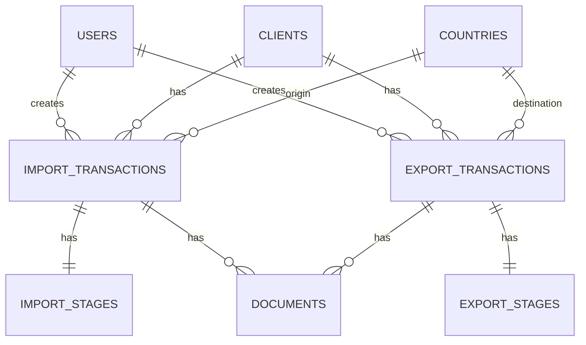

# F.M. Morata Freight Management System (MorataFMS)

## Project Overview

**MorataFMS** is a transaction tracking system built for **F.M. Morata**, a freight/customs brokerage company. The system tracks **import and export transactions** through their respective processing stages, manages client records, and handles document storage.

---

## Tech Stack

### Backend
| Technology | Version | Purpose |
|---|---|---|
| PHP | ^8.2 | Runtime |
| Laravel | ^12.0 | Framework |
| Laravel Sanctum | ^4.0 | SPA Authentication (cookie-based CSRF) |
| Laravel Breeze (API) | — | Auth scaffolding |
| MySQL | — | Database (`morata_fms`) |

### Frontend
| Technology | Version | Purpose |
|---|---|---|
| React | ^19.2.0 | UI Library |
| React Router DOM | ^7.13.0 | Client-side routing |
| Axios | ^1.13.4 | HTTP client |
| Vite | — | Build tool / Dev server |
| Tailwind CSS | v4 | Styling (via `@tailwindcss/vite` plugin) |
| TypeScript | — | Type safety |

### Development Environment
- **OS**: Windows
- **Backend URL**: `http://localhost:8000`
- **Frontend URL**: `http://localhost:3000`
- **Database**: MySQL on `127.0.0.1:3306`, database name `morata_fms`
- **Default Admin**: `admin@morata.com` / `password`

---

## Authentication

**Type**: Cookie-based SPA authentication with CSRF protection (Laravel Sanctum)

### Flow
1. Frontend calls `GET /sanctum/csrf-cookie` to obtain CSRF token
2. Frontend sends `POST /api/auth/login` with credentials + CSRF token
3. Laravel creates session, sets HttpOnly session cookie
4. All subsequent API calls authenticated via session cookie automatically
5. Logout invalidates the session

### Security Features
- ✅ CSRF protection enabled
- ✅ HttpOnly session cookies (not accessible by JavaScript)
- ✅ Session stored in database (`sessions` table)
- ✅ `withCredentials: true` in Axios
- ✅ `withXSRFToken: true` in Axios
- ✅ No tokens stored in localStorage
- ✅ Rate limiting on login (5 attempts) and API routes (`throttle:60,1`)

---

## Database Schema

### Entity Relationship Diagram



### Tables

#### `countries`
Reference table with 14 pre-seeded countries.
- `id`, `name`, `code` (ISO), `timestamps`

#### `clients`
- `id`, `name`, `email`, `phone`, `address`, `tin` (Tax ID), `timestamps`

#### `import_transactions`
- `id`, `customs_ref_no` (unique), `bl_no`, `selective_color`
- `importer_id` (FK → clients), `arrival_date`
- `assigned_user_id` (FK → users, server-managed), `status` (server-managed: pending/in_progress/completed/cancelled)
- `notes`, `timestamps`

#### `import_stages` (6-stage pipeline)
Each stage has: `{stage}_status`, `{stage}_completed_at`, `{stage}_completed_by`

| Stage | Description |
|---|---|
| `boc` | Bureau of Customs |
| `ppa` | Philippine Ports Authority |
| `do` | Delivery Order |
| `port_charges` | Port Charges |
| `releasing` | Releasing |
| `billing` | Billing |

#### `export_transactions`
- `id`, `shipper_id` (FK → clients), `bl_no`, `vessel`
- `destination_country_id` (FK → countries)
- `assigned_user_id` (FK → users, server-managed), `status` (server-managed)
- `notes`, `timestamps`

#### `export_stages` (4-stage pipeline)
Each stage has: `{stage}_status`, `{stage}_completed_at`, `{stage}_completed_by`

| Stage | Description |
|---|---|
| `docs_prep` | Document Preparation |
| `co` | Certificate of Origin |
| `cil` | Certificate of Inspection & Loading |
| `bl` | Bill of Lading |

#### `documents` (polymorphic)
- `id`, `documentable_type`, `documentable_id` (polymorphic to import/export, server-managed)
- `type` (invoice, packing_list, bl, co, cil, etc.)
- `original_name`, `file_path`, `mime_type`, `size_bytes`
- `uploaded_by` (server-managed), `timestamps`

#### `users`
- Default Laravel users table + `role` column
- Roles: `encoder`, `broker`, `supervisor`, `manager`, `admin`
- `role` is **NOT** in `$fillable` — must be set explicitly to prevent privilege escalation

---

## Eloquent Models

| Model | Key Features |
|---|---|
| `User` | Role helpers (`isAdmin()`, `hasRoleAtLeast()`), `ROLE_HIERARCHY` constant |
| `Country` | `importTransactions`, `exportTransactions` relationships |
| `Client` | Scopes: `active()`, `importers()`, `exporters()` |
| `ImportTransaction` | `stages`, `importer`, `assignedUser` relationships, `progress` computed |
| `ImportStage` | `markStageComplete(stage, userId)` helper |
| `ExportTransaction` | `stages`, `shipper`, `assignedUser`, `destinationCountry` relationships |
| `ExportStage` | `markStageComplete(stage, userId)` helper |
| `Document` | Polymorphic, `formattedSize` accessor, `getTypeLabels()` |

---

## API Routes

### Authentication (`/api/auth/...`)
| Method | Endpoint | Description |
|---|---|---|
| POST | `/api/auth/login` | Login (returns user data) |
| POST | `/api/auth/logout` | Logout (invalidates session) |
| POST | `/api/auth/register` | Register new user |
| POST | `/api/auth/forgot-password` | Send password reset email |
| POST | `/api/auth/reset-password` | Reset password |

### Protected (`auth:sanctum` + `throttle:60,1`)
| Method | Endpoint | Description |
|---|---|---|
| GET | `/api/user` | Get authenticated user |
| GET | `/api/import-transactions` | List import transactions |
| POST | `/api/import-transactions` | Create import transaction |
| GET | `/api/export-transactions` | List export transactions |
| POST | `/api/export-transactions` | Create export transaction |
| GET | `/api/clients` | List clients |

### Authorization (Policies)
| Resource | viewAny | create | update | delete |
|---|---|---|---|---|
| ImportTransaction | All users | All users | Creator or Supervisor+ | Manager+ |
| ExportTransaction | All users | All users | Creator or Supervisor+ | Manager+ |
| Client | All users | Supervisor+ | Supervisor+ | Admin only |

---

## Frontend Architecture

### Structure
```
frontend/src/
├── App.tsx                              # Root component with routes
├── main.tsx                             # Entry point (BrowserRouter)
├── index.css                            # Tailwind v4 + custom animations
├── lib/
│   └── axios.ts                         # Axios instance (baseURL, CSRF, withCredentials)
├── context/
│   └── ThemeContext.tsx                  # Dark/light mode toggle
├── components/                          # Shared components
│   ├── ConfirmationModal.tsx            # Reusable confirmation dialog
│   ├── Icon.tsx                         # SVG icon component
│   ├── Logo.tsx                         # App logo
│   ├── Pagination.tsx                   # Pagination controls
│   └── layout/
│       ├── ErrorLayout.tsx              # Error boundary layout
│       └── NotFoundPage.tsx             # 404 page
├── hooks/
│   └── useConfirmationModal.ts          # Confirmation modal hook
├── features/
│   ├── auth/
│   │   ├── api/authApi.ts               # login(), logout(), getCsrfCookie()
│   │   ├── components/
│   │   │   ├── AuthPage.tsx             # Auth page layout
│   │   │   ├── LoginForm.tsx            # Login form with validation
│   │   │   ├── SignupForm.tsx           # Registration form
│   │   │   ├── GuestRoute.tsx           # Redirect if authenticated
│   │   │   └── ProtectedRoute.tsx       # Redirect if not authenticated
│   │   ├── context/AuthContext.tsx       # AuthProvider + useAuth
│   │   ├── hooks/useAuth.ts             # Auth hook
│   │   ├── types/auth.types.ts          # User, AuthState types
│   │   └── index.ts                     # Barrel exports
│   └── tracking/
│       ├── api/trackingApi.ts           # Transaction API calls
│       ├── components/
│       │   ├── MainLayout.tsx           # App shell (sidebar + content)
│       │   ├── TrackingDashboard.tsx     # Dashboard with stats
│       │   ├── ImportList.tsx            # Import transactions list
│       │   ├── ExportList.tsx            # Export transactions list
│       │   ├── TrackingDetails.tsx       # Transaction detail view
│       │   ├── Documents.tsx            # Document management
│       │   ├── EncodeModal.tsx          # Create/edit transaction modal
│       │   ├── CalendarCard.tsx         # Calendar widget
│       │   ├── StatusChart.tsx          # Status chart widget
│       │   └── Profile.tsx             # User profile page
│       ├── types.ts                     # Transaction types
│       └── index.ts                     # Barrel exports
```

### Design System
- **Dark theme** with F.M. Morata branding (dark mode support via ThemeContext)
- **Glassmorphic** card design on auth pages
- **Inter** font family (Google Fonts)
- Custom animations: gradient-shift, floating-orb, fade-in, shimmer

---

## What's Built ✅

- [x] Laravel 12 backend with Breeze API scaffolding
- [x] MySQL database schema (8 custom migrations)
- [x] 8 Eloquent models with relationships and helpers
- [x] Country seeder (14 countries) + Admin user seeder
- [x] Cookie-based SPA authentication with CSRF protection
- [x] Login/Logout/Register endpoints
- [x] React 19 frontend with Vite + Tailwind v4
- [x] Auth pages (Login + Signup) with glassmorphic design
- [x] Auth context/provider with protected + guest route guards
- [x] Tracking dashboard with stats
- [x] Import/Export transaction list views
- [x] Transaction detail view with stage tracking
- [x] Encode modal for create/edit transactions
- [x] Document management UI
- [x] Dark mode support (ThemeContext)
- [x] API Security Hardening (Policies, mass assignment protection, rate limiting)
- [x] Security tests for mass assignment protection

## What's Not Built Yet ❌

- [ ] Full CRUD API for transactions (show, update, delete endpoints)
- [ ] CRUD API for clients (store, update, delete)
- [ ] Document upload API (store, download, delete)
- [ ] Role-based UI (show/hide actions based on user role)
- [ ] Search and filtering
- [ ] Pagination (component exists, needs wiring)
- [ ] Error handling / toast notifications
- [ ] User management (admin panel)
