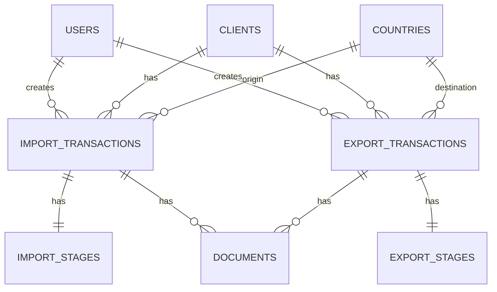

# F.M. Morata Freight Management System (MorataFMS)

## Project Overview

**MorataFMS** is a transaction tracking system built for **F.M. Morata**, a freight/customs brokerage company. The system tracks **import and export transactions** through their respective processing stages, manages client records, and handles document storage.

---

## Tech Stack

### Backend
| Technology | Version | Purpose |
|---|---|---|
| PHP | ^8.2 | Runtime |
| Laravel | ^12.0 | Framework |
| Laravel Sanctum | ^4.0 | SPA Authentication (cookie-based CSRF) |
| Laravel Breeze (API) | — | Auth scaffolding |
| MySQL | — | Database (`morata_fms`) |

### Frontend
| Technology | Version | Purpose |
|---|---|---|
| React | ^19.2.0 | UI Library |
| React Router DOM | ^7.13.0 | Client-side routing |
| Axios | ^1.13.4 | HTTP client |
| Vite | — | Build tool / Dev server |
| Tailwind CSS | v4.1.18 | Styling (via `@tailwindcss/vite` plugin) |
| TypeScript | — | Type safety |

### Development Environment
- **OS**: Windows
- **Backend URL**: `http://localhost:8000`
- **Frontend URL**: `http://localhost:3000`
- **Database**: MySQL on `127.0.0.1:3306`, database name `morata_fms`
- **Branch**: `testing` (main branch kept clean)

---

## Authentication

**Type**: Cookie-based SPA authentication with CSRF protection (Laravel Sanctum)

### Flow
1. Frontend calls `GET /sanctum/csrf-cookie` to obtain CSRF token
2. Frontend sends `POST /api/auth/login` with credentials + CSRF token
3. Laravel creates session, sets HttpOnly session cookie
4. All subsequent API calls authenticated via session cookie automatically
5. Logout invalidates the session

### Security Features
- ✅ CSRF protection enabled
- ✅ HttpOnly session cookies (not accessible by JavaScript)
- ✅ Session stored in database (`sessions` table)
- ✅ `withCredentials: true` in Axios
- ✅ `withXSRFToken: true` in Axios
- ✅ No tokens stored in localStorage

### Default Admin Account
- **Email**: `admin@morata.com`
- **Password**: `password`

---

## Database Schema

### Entity Relationship Diagram



### Tables

#### `countries`
Reference table with 14 pre-seeded countries.
- `id`, `name`, `code` (ISO), `timestamps`

#### `clients`
- `id`, `name`, `email`, `phone`, `address`, `tin` (Tax ID), `timestamps`

#### `import_transactions`
- `id`, `reference_number` (unique), `client_id`, `country_id` (origin)
- `description`, `vessel_name`, `eta`, `ata`
- `total_value`, `currency`, `status` (pending/in_progress/completed/cancelled)
- `created_by` (user), `notes`, `timestamps`

#### `import_stages` (6-stage pipeline)
Each stage has: `{stage}_status`, `{stage}_completed_at`, `{stage}_completed_by`

| Stage | Description |
|---|---|
| `boc` | Bureau of Customs |
| `ppa` | Philippine Ports Authority |
| `do` | Delivery Order |
| `port_charges` | Port Charges |
| `releasing` | Releasing |
| `billing` | Billing |

#### `export_transactions`
- `id`, `reference_number` (unique), `client_id`, `country_id` (destination)
- `description`, `vessel_name`, `etd`, `atd`
- `total_value`, `currency`, `status`
- `created_by` (user), `notes`, `timestamps`

#### `export_stages` (4-stage pipeline)
Each stage has: `{stage}_status`, `{stage}_completed_at`, `{stage}_completed_by`

| Stage | Description |
|---|---|
| `docs_prep` | Document Preparation |
| `co` | Certificate of Origin |
| `cil` | Certificate of Inspection & Loading |
| `bl` | Bill of Lading |

#### `documents` (polymorphic)
- `id`, `documentable_type`, `documentable_id` (polymorphic to import/export)
- `type` (invoice, packing_list, bl, co, cil, etc.)
- `original_name`, `file_path`, `mime_type`, `size_bytes`
- `uploaded_by`, `timestamps`

#### `users`
- Default Laravel users table + `role` column (admin/user)

---

## Eloquent Models

| Model | Key Features |
|---|---|
| `User` | `role` in fillable, `HasApiTokens` trait |
| `Country` | `clients`, `importTransactions`, `exportTransactions` relationships |
| `Client` | `country`, `importTransactions`, `exportTransactions` relationships |
| `ImportTransaction` | `stages` relationship, `progress` computed attribute |
| `ImportStage` | `markStageComplete(stage, userId)` helper |
| `ExportTransaction` | `stages` relationship, `progress` computed attribute |
| `ExportStage` | `markStageComplete(stage, userId)` helper |
| `Document` | Polymorphic, `formattedSize` accessor, `getTypeLabels()` |

---

## API Routes

### Authentication (`/api/auth/...`)
| Method | Endpoint | Description |
|---|---|---|
| POST | `/api/auth/register` | Register new user |
| POST | `/api/auth/login` | Login (returns user data) |
| POST | `/api/auth/logout` | Logout (invalidates session) |
| POST | `/api/auth/forgot-password` | Send password reset email |
| POST | `/api/auth/reset-password` | Reset password |

### Protected (`auth:sanctum`)
| Method | Endpoint | Description |
|---|---|---|
| GET | `/api/user` | Get authenticated user |

### Public
| Method | Endpoint | Description |
|---|---|---|
| GET | `/api/hello` | Health check |
| GET | `/api/users` | List all users |

---

## Frontend Architecture

### Structure
```
frontend/src/
├── App.tsx                          # Root component with routes
├── main.tsx                         # Entry point (BrowserRouter)
├── index.css                        # Tailwind v4 + custom animations
├── lib/
│   └── axios.ts                     # Axios instance (baseURL, CSRF config)
├── features/
│   ├── auth/
│   │   ├── api/authApi.ts           # Login, logout, CSRF API calls
│   │   ├── components/
│   │   │   ├── LoginPage.tsx        # Login page layout (glassmorphic)
│   │   │   └── LoginForm.tsx        # Login form with validation
│   │   ├── context/AuthContext.tsx   # AuthProvider + AuthContext
│   │   ├── hooks/useAuth.ts         # useAuth custom hook
│   │   ├── types/auth.types.ts      # User, AuthState, AuthResponse types
│   │   └── index.ts                 # Barrel exports
│   └── dashboard/
│       ├── components/
│       │   ├── Dashboard.tsx         # Main dashboard page
│       │   ├── DashboardHeader.tsx   # Header with user info
│       │   ├── DashboardLayout.tsx   # Layout wrapper
│       │   ├── DashboardStats.tsx    # Statistics section
│       │   ├── StatCard.tsx          # Individual stat card
│       │   ├── TransactionSection.tsx
│       │   └── TransactionSections.tsx
│       ├── types/dashboard.types.ts
│       └── index.ts                 # Barrel exports
```

### Routes
| Path | Component | Description |
|---|---|---|
| `/` | Redirect → `/login` | Root redirect |
| `/login` | `LoginPage` | Authentication page |
| `/dashboard` | `Dashboard` | Main dashboard (placeholder) |

### Design System
- **Dark theme** with F.M. Morata branding
- **Glassmorphic** card design on login page
- **Inter** font family (Google Fonts)
- Custom animations: gradient-shift, floating-orb, fade-in, shimmer

---

## What's Been Built ✅

- [x] Laravel 12 backend with Breeze API scaffolding
- [x] MySQL database schema (8 custom migrations)
- [x] 8 Eloquent models with relationships and helpers
- [x] Country seeder (14 countries)
- [x] Admin user seeder
- [x] Cookie-based SPA authentication with CSRF protection
- [x] Login/Logout API endpoints
- [x] React 19 frontend with Vite + Tailwind v4
- [x] Login page with glassmorphic design
- [x] Auth context/provider with useAuth hook
- [x] Placeholder dashboard with component structure
- [x] Axios configured with CSRF support

## What's Not Built Yet ❌

- [ ] API endpoints (CRUD) for import/export transactions
- [ ] API endpoints for clients management
- [ ] API endpoints for documents (upload/download)
- [ ] API endpoints for countries
- [ ] Dashboard populated with real data
- [ ] Transaction creation/edit forms
- [ ] Transaction detail view with stage tracking
- [ ] Document upload/management UI
- [ ] Client management UI
- [ ] Role-based access control (admin vs user)
- [ ] Protected route guards (redirect to login if not authenticated)
- [ ] Search and filtering
- [ ] Pagination
- [ ] Error handling / toast notifications
