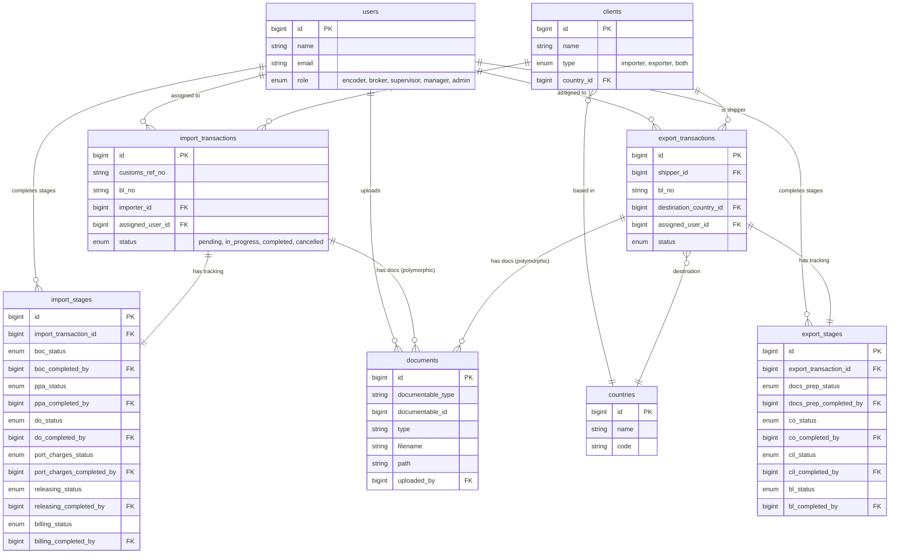

# F.M. Morata FMS - Database Schema Diagram

This document illustrates the database relationships for the Freight Management System using Mermaid.js.

## Key Relationships Key

| Relationship | Description |
|---|---|
| **Users ↔ Transactions** | A user is assigned to handle specific transactions (Import/Export). |
| **Users ↔ Stages** | Specific users mark individual stages (e.g., BOC, PPA) as completed. |
| **Clients ↔ Transactions** | Clients are linked as 'importer' for Imports or 'shipper' for Exports. |
| **Transactions ↔ Stages** | One-to-One. Each transaction has exactly one matching record in the corresponding stages table. |
| **Transactions ↔ Documents** | One-to-Many (Polymorphic). Both Import and Export transactions can have multiple attached documents. |
